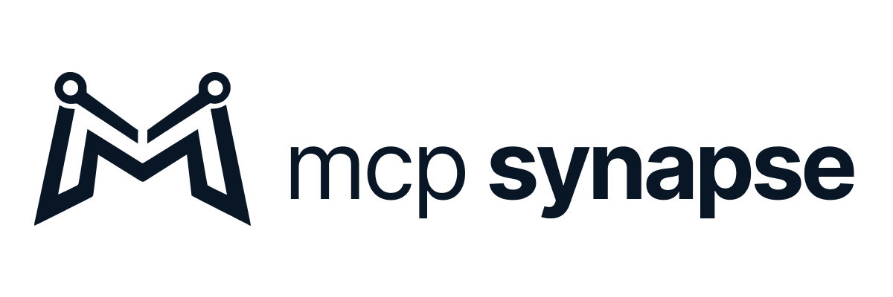

# MCP Synapse

MCP Synapse is a provider-agnostic MCP control plane for managing connections, routing requests, and enforcing policy and resilience controls across AI vendors. It provides a local-first desktop runtime while keeping provider execution in the backend core.

<picture>
  <source media="(prefers-color-scheme: dark)" srcset="docs/brand_assets/mcp-lockup-horizontal-dark.png">
  
</picture>

## Early Access Status

This repository is in the `v0.8.0` Early Access release lane.
- Current release: [`docs/release/releases/v0.8.0/`](docs/release/releases/v0.8.0/)
- Documentation: [`docs/`](docs/)

## Source Visibility and Usage

MCP Synapse source is publicly viewable, but this project is not open source.  
All rights are reserved unless explicitly granted by Solid Synapse.  
Forks, modified builds, and redistributed versions must not use MCP Synapse branding in a way that implies official distribution or endorsement.

## Quick Start

1. Download the latest official GitHub release: <https://github.com/solidsynapse/MCP-Synapse/releases/latest>
2. Verify installer hashes against [`SHA256SUMS.txt`](docs/release/releases/v0.8.0/SHA256SUMS.txt).
3. Install and launch MCP Synapse.
4. If Windows SmartScreen appears, review the published release notes and checksums before choosing whether to continue.

## Why MCP Synapse Exists

- Provider-agnostic operational surface for MCP connection management and routing controls
- Local-first, BYOK posture for credentials and runtime operation
- Deterministic request handling with explicit error behavior
- Consolidated policy, resilience, and usage visibility in one desktop app

## Key Capabilities

- Connection lifecycle operations (create, edit, start, stop, delete)
- Multi-provider connection surface across Vertex AI, OpenAI, Azure OpenAI, HuggingFace, Ollama, Anthropic, Groq, Gemini, OpenRouter, DeepSeek, and xAI/Grok
- REST API adapter for local-first MCP access to arbitrary JSON endpoints
- Dashboard and usage visibility for request-level operations
- Policy surfaces (Persona, Optimizations)
- Resilience surfaces (Budget Guards with monitor/block/throttle enforcement, Interceptors)
- Packaged desktop runtime with release integrity artifacts

## Architecture Boundaries

- UI is a thin shell: collect state, dispatch requests, render results
- Production UI request path goes through a single dispatch entrypoint
- Provider and network logic remain in backend core under `src/`
- No hidden retry/backoff or silent fallback on product paths

## Security Model (Local-First / BYOK)

- Credentials are user-owned and managed locally
- Runtime behavior is designed to be explicit and deterministic
- Security reporting and disclosure policy: [`SECURITY.md`](SECURITY.md)
- Release integrity artifacts: [`docs/release/releases/v0.8.0/SHA256SUMS.txt`](docs/release/releases/v0.8.0/SHA256SUMS.txt)

## Install and Verify Release Integrity

- Latest GitHub release: <https://github.com/solidsynapse/MCP-Synapse/releases/latest>
- Release notes: [`docs/release/releases/v0.8.0/RELEASE_NOTES.md`](docs/release/releases/v0.8.0/RELEASE_NOTES.md)
- What changed: [`docs/release/releases/v0.8.0/WHAT_CHANGED.md`](docs/release/releases/v0.8.0/WHAT_CHANGED.md)
- Known issues: [`docs/release/releases/v0.8.0/KNOWN_ISSUES.md`](docs/release/releases/v0.8.0/KNOWN_ISSUES.md)
- SHA256 checksums: [`docs/release/releases/v0.8.0/SHA256SUMS.txt`](docs/release/releases/v0.8.0/SHA256SUMS.txt)

PowerShell hash verification example:

```powershell
Get-FileHash -Algorithm SHA256 .\MCP Synapse_0.8.0_x64-setup.exe
```

Compare the output hash with `SHA256SUMS.txt`.

## Documentation and Support

- Product docs: https://mcpsynapse.dev/docs
- Feedback: https://mcpsynapse.dev/feedback
- About: https://mcpsynapse.dev
- Check for updates: https://mcpsynapse.dev/download
- Product issues: GitHub Issues
- Security reports: [`SECURITY.md`](SECURITY.md)
